# Aplikacja webowa służąca do wizualizacji i analizy danych ekonomicznych
Projekt indywidualny, Jakub Haraszkiewicz, 2025

## Skrócony opis projektu
W ramach projektu stworzono aplikację webową służącą do wyświetlania wizualizacji danych ekonowmicznych w postaci wykresów. Dodano też opcję wgrania własnych danych w formacie .csv. Aplikacja napisana jest w Blazor Web Assembly w języku C#. Wykresy są tworzone przy użyciu biblioteki ApexCharts z własnymi modyfikacjami. Baza danych PostgreSQL dla aplikacji jest hostowana w serwisie aiven z darmowym planem. Rozwiązanie FinantialData.sln składa się z czterech projektów: FinantialData.API, FinantialData.Shared, FinantialData.WebClient, Blazor-ApexCharts.

## Struktura projektu

### Baza danych
Baza danych PostgreSQL składa się z czterech tabel:
#### DataType
Zawiera wszystkie typy danych zawarte w bazie (Inflacja, PKB...)
#### Frequency
Zawiera dostępne częstotliwości danych (co miesiąc, co kwartał, co rok)
#### PresentationType
Zawiera dostępne sposoby prezentacji danych (jednostka, indeks)
#### Records
Zawiera wszystkie dane. Każdy rekord w tej tabeli jest opisany datą, wartością, typem danych, częstotliwością danych i sposobem prezentacji danych

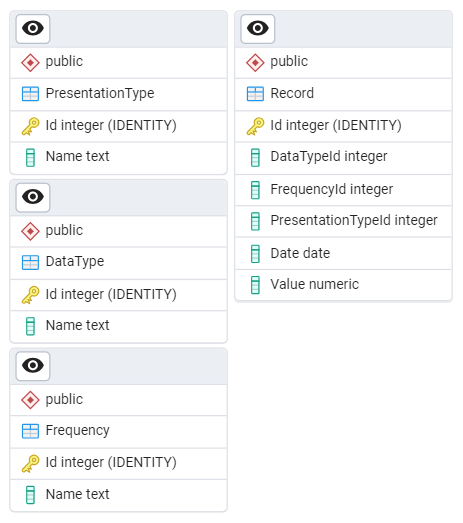

### Shared classes
Klasy dzielone między pojektami api i webclient, modele do bazy danych:

`Record`, `PresetationType`, `Frequency`, `DataType` - modele na podstawie których powstały tabele w bazie danych, posiadają analogiczne pola. `PresetationType`, `Frequency` i `DataType` implementują interfejs `IParam` który poza `Id` i `Name` wymusza na tych klasach statyczny string `Link` zawierający ciąg znaków używany w zapytaniach. Klasa `Record` zawiera dodatkowe property typu string `DateString` które zwraca stringa opisującego skrótowo datę w formacie zależnym od `FrequencyId` (z dokładnością do roku dla danych rocznych, do kwartału dla kwartalnych, do miesiąca dla miesiącznych)

`SelectionResult` - klasa zawierająca trzy pola id (`DataTypeId`, `FrequencyId` i `PresentationTypeId`) i string `Caption` łączący wszystkie parametry w opis szukanych rekordów (np. PKB + rocznie + mln zł)

`RecordDTO` - podobna do klasy `Records`, jednak zamiast pól typu int dla id zawiera pola typu string dla nazw parametrów.

Folder `Record` zawiera dodatkowe klasy:  
`ScatterPoint` - zawiera `Date`, `DateString` (jak `Record`) oraz pola decimal `X` i `Y` (zamiast jednego `Value`)  
`Series<T>` - abstrakcyjna klasa zawierająca listę `Points` obiektów typu `T`
`LineSeries` - klasa dziedzicząca po `Series<Record>`, zawiera pole z nazwą serii  
`ScatterSeries` - klasa dziedzicząca po `Series<ScatterPoint>`, zawiera nazwy dwóch serii z których składa się seria scatter, konstruktor tworzący serię scatter z dwóch serii liniowych i funkcję zwracającą marginesy dla wykresu scatter w kierunku x lub y.

### Backend API

API zawiera dwa kontrolery: `RecordController` i `DataParamsController`. Każdy z nich ma swój pomocniczy serwis.

#### Zapytania `RecordController`:
`GetRecords`: Przyjmuje obiekt typu `SelectionResult` i na jego podstawie pobiera odpowiednie recordy z tabeli Record i zwraca je jako listę obiektów typu `Record`.

`AddRecords`: Przyjmuje plik który powinien zawierać nowe rekordy w formacie .csv, odczytuje je i zapisuje do tabeli Record, nadpisuje rekordy znajdujące się już w tabeli (mające takie same parametry).

`RemoveRecords`: Przyjmuje obiekt typu `SelectionResult` i na jego podstawie usuwa odpowiednie recordy z tabeli Record.

#### Zapytania `DataParamsController`
`DataTypes`: zwraca listę wszystkich typów danych

`Frequencies`: zwraca listę częstotliwości dostępnych dla danego typu danych i typu prezentacji danych, domyślnie zwraca wszystkie.

`PresentationTypes`: zwraca liste typów prezentacji danych dostępnych dla danego typu danych i częstotliwości, domyślnie zwraca wszystkie

### Frontend Web Client

#### Pages

Klient webowy składa się z dwóch stron: `Viewer.razor` i `DataManager.razor`. W pliku `MainLayout.razor` zrobiono górny pasek nawigacyjny umożliwiający przełączanie między stronami. Obie strony dziedziczą po klasie `SelectionParent` aby umożliwić odświeżanie ich z poziomu komponentu `Selector`. Strona `Viewer` służy do wyświetlania kafelków z wykresami, a `DataManager` do zarządzania bazą danych (dodawanie/usuwanie rekordów) oraz wyświetlania wybranych danych w tabeli.

#### Components

Stworzone komponenty blazor używane na stronach:  
`Selector` - używany zarówno w `Viewer` jak i `DataManager`. Służy do wybierania rekordów z bazy danych według trzech dostępnych parametrów.  
`ChartComponent` - główna zawartość kafla z `Viewer`. Zawiera obiekt ApexCharts oraz liste wykresów na nim wyświetlanych z możliwością ich usuwania.  
`ChartList` - lista wykresów w komponencie `ChartComponent`  
`RecordGrid`, `ParamGrid` - komponenty wyświetlające tabele parametrów i wybranych rekordów na stronie `DataManager`  
`FileUploader` - komponent obsługujący wgrywanie plików z nowymi rekordami w `DataManager`

### Modyfikacja ApexCharts
Do rozwiązania dołączono kod wrappera ApexCharts dla Blazor i zmodyfikowano go aby był dostosowany do potrzeb projektu.
Dodano nowy typ wykresu `ApexBubbleSeriesDirect` na podstawie typu `ApexBubbleSeries`. W oryginalnym `ApexBubbleSeries` bąble na wykresie reprezentowały grupy danych, a ich położenie w osi Y i rozmiar były zależne od podanych funkcji przyjmujących liste danych w grupie. W nowym `ApexBubbleSeriesDirect` każdy bąbel reprezentuje jedną trójwymiarową daną, gdzie położenie na płaszczyźnie XY zależy od wartości dwóch wskaźników (np. inflacja i PKB), a rozmiar zależy od daty danej pary rekordów (im nowszy tym większy), przy czym jest to opcjonalne. Do `ApexBubbleSeriesDirect` dodano również pole `Extra` do przypisywania wartości polu `Extra` z `BubblePoint` które istniało oryginalnie ale nie było używane. Pola `Extra` użyto do przekazywania daty w formie tekstowej (`DateString`). Było to potrzebne aby data wyświetlająca się na tooltipie przy najeżdżaniu na wykres była w formacie odpowiednim dla częstotliwości danych danego wyresu. Tooltip w ApexCharts konfiguruje się za pomocą funkcji javascript:
```JavaScript
function (val, opts) {return opts.w?.globals.initialSeries[opts.seriesIndex].data[opts.dataPointIndex].extra;}
```

## Funkcjonalności aplikacji

### Viewer

Strona `Viewer` składa się z pasku bocznego i obszaru do wyświetlania kafli z wykresami. Na pasku bocznym jest przycisk "Dodaj wykres" który dodaje na obszar nowy pusty kafel, oraz selektor do wybierania parametrów danych które chcemy wyświetlić.   

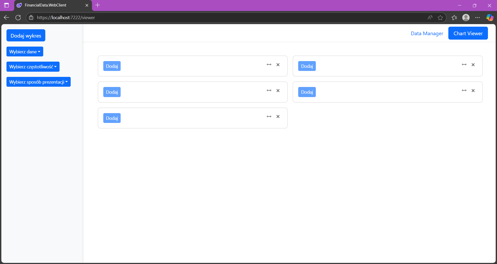  

Selektor składa się z trzech dropdownów, po jednym na każdy parametr: typ danych, częstotliwość, sposób prezentacji. Zawartość dropdownów jest aktualizowana w zależności od tego co wybrano na pozostałych: jeżeli jako typ danych wybrano PKB, dostępne są częstotliwości rocznie i kwartalnie oraz sposoby prezentacji w mln zł lub w odniesieniu do wartości bazowej, jeżeli jako typ danych wybrano bezrobocie, dostępna jest częstotliwość miesięcznie i sposób prezentacji w procentach. Selektor na bierząco sprawdza które opcje są dostępne filtrując tabelę Records.  

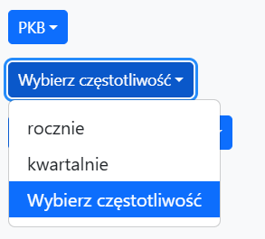
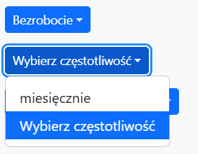

Na każdym kaflu jest przycisk "Dodaj" który dodaje do kafla wykres wybrany w menu bocznym. Przycisk ten jest aktywny tylko jeżeli w menu wybrano wykres którego nie dodano jeszcze do danego kafla. Lista dodanych wykresów znajduje sięmiędzy obszarem wykresów a przyciskiem dodaj. Obok każdej nazwy wykresu na liście znajduje się przycisk usuwający ten wykres z kafla.   

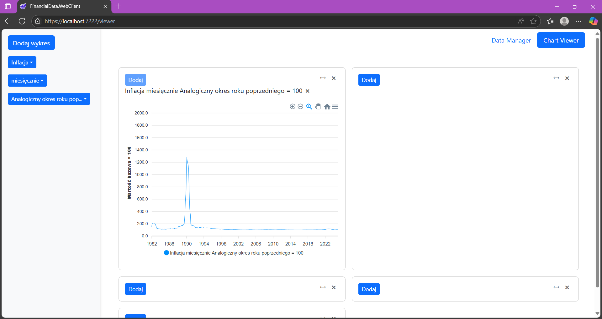  

Każdy kafel można zamknąć lub rozszerzyć na pełną szerokość (zamiast połowy) za pomocą przycisków w górnym rogu.  

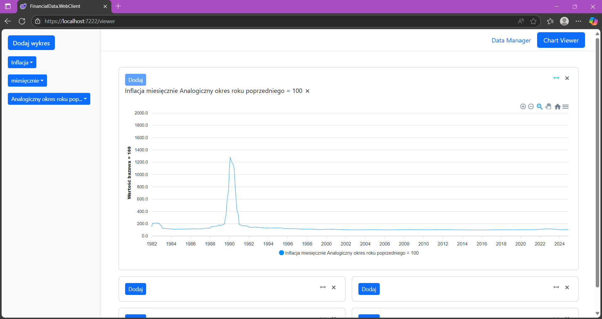  

Kiedy na kaflu są dwa wykresy, pod listą pojawia się checkbox "Scatter" którego odchaczenie zastępuje dwa wykresy liniowe wykresem korelacji dwóch zestawów danych.  

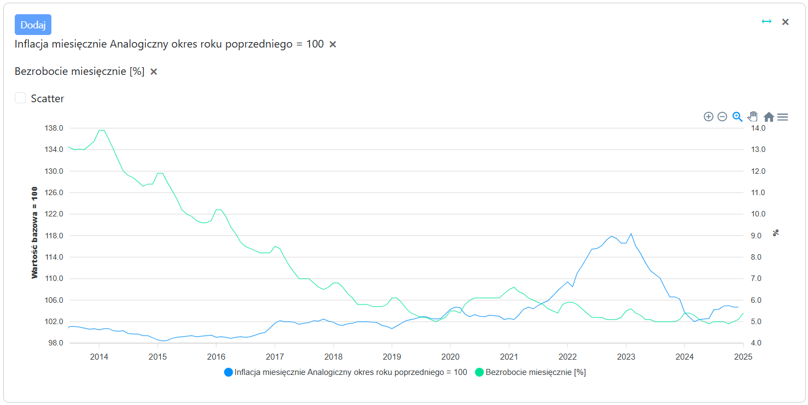 
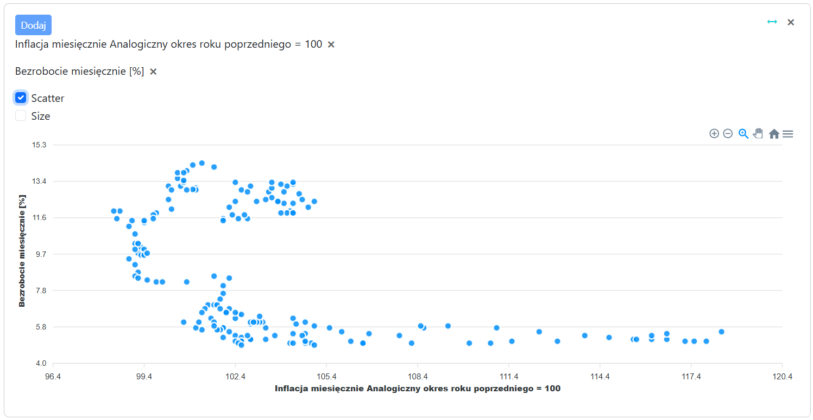
Pojawia się wtedy kolejny checkbox "Size" który odpowiada za wyświetlanie punktów w różnym rozmiarze zależnie od daty, dzięki czemu widać wizualnie chronologię danych.  

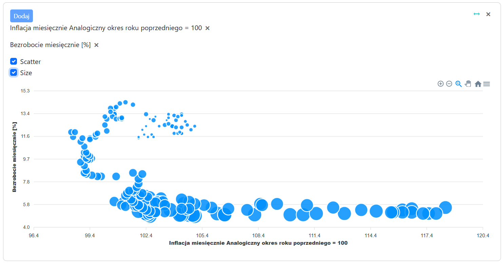  

Kiedy na jednym kaflu są dwa wykresy o różnych częstotliwościach, data na tooltipie jest w różnym formacie zaleznie od wykresu na który się najedzie (dzięki indywidualnym przekazaniu jej w `Extra`)

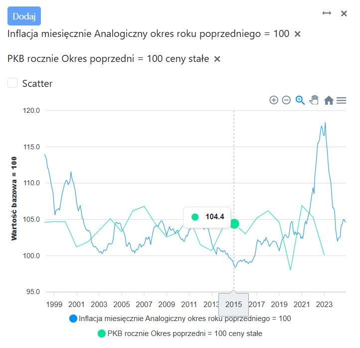
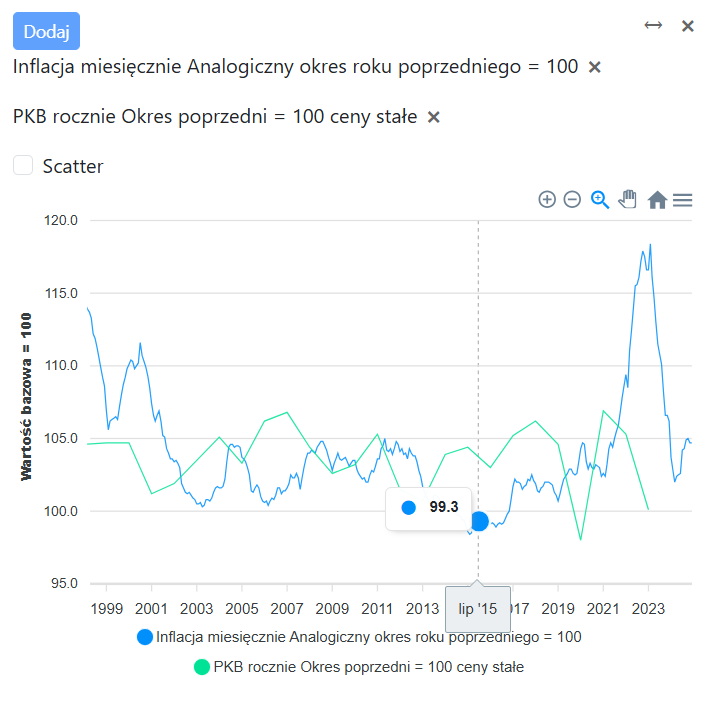  

Na wykresie scatter wyświetlana jest data z danych o większej częstotliwośći przy czym przy miesiącach jet to zawsze styczeń a przy kwartałach zawsze kwartał pierwszy.

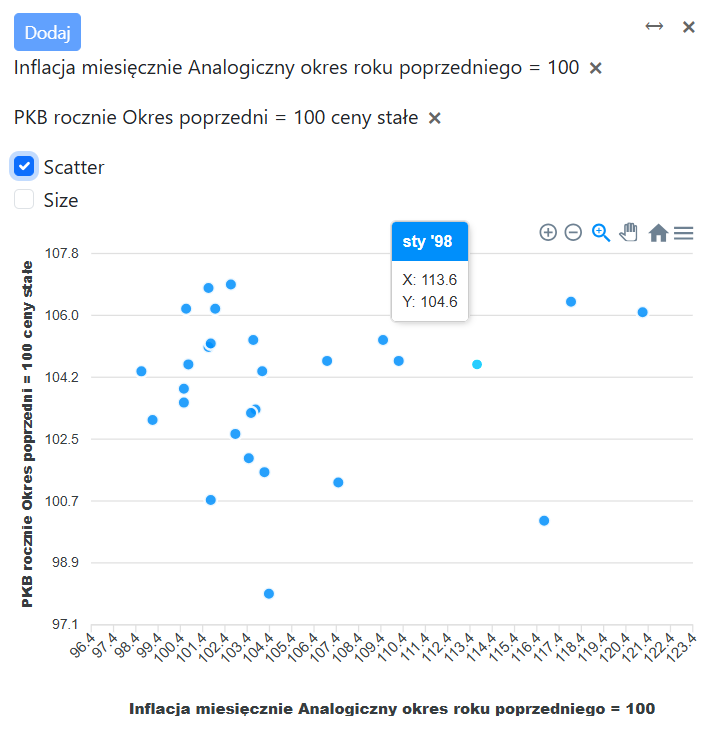

### DataManager

Na stronie `DataManager` znajdują się: lista dostępnych typów danych, lista dostępnych sposobów prezentacji danych (jednostek), selektor, uploader plików z nowymi rekordami, tabela wybranych rekordów.  
Selektor działa tak samo jak w `Viewer`. Znajdują się pod nim przyciski "Usuń" - do usuwania wybranych danych i "Zobacz" - do  wyświetlania danych w tabeli podglądu.  
Listy typów danych i jednostek są aktualizowane na bierząco: jeżeli dodano rekordy z nowym typem danych lub jednostką tabele DataTypes i PresentationTypes są aktualizowane a ich zawartość wyświetlana w listach na stronie. Typy danych i jednostki są usuwane z listy (i bazy danych) jeżeli w tabeli Record nie ma już ani jednego rekordu który ich używa.  

Dodawanie danych z pliku:

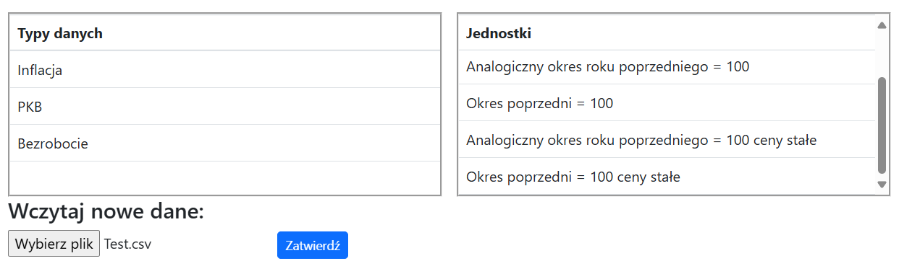
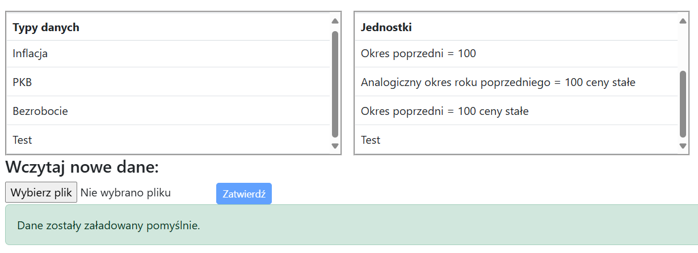  

Próba wgrania niepoprawnego pliku:

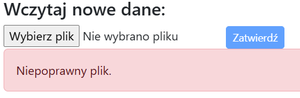

Przykładowy poprawny plik:

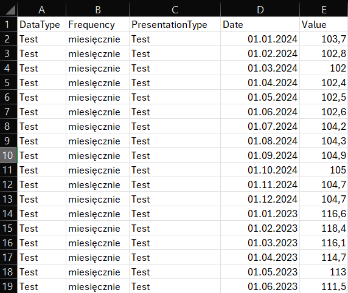

Usuwanie danych:  

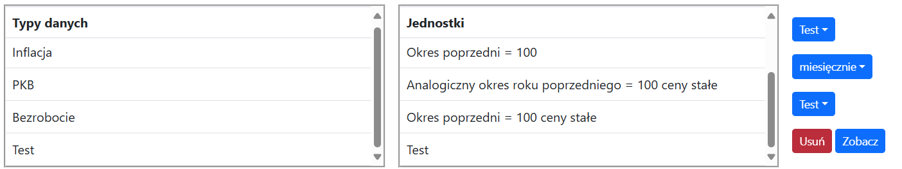
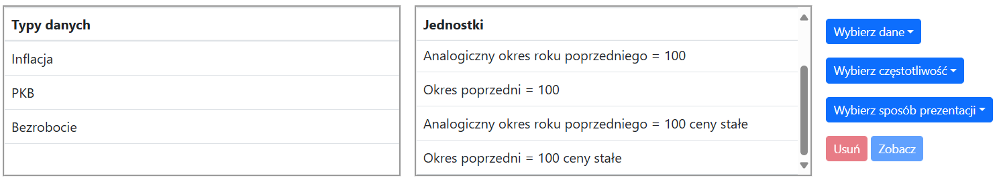

Wyświetlanie danych:  

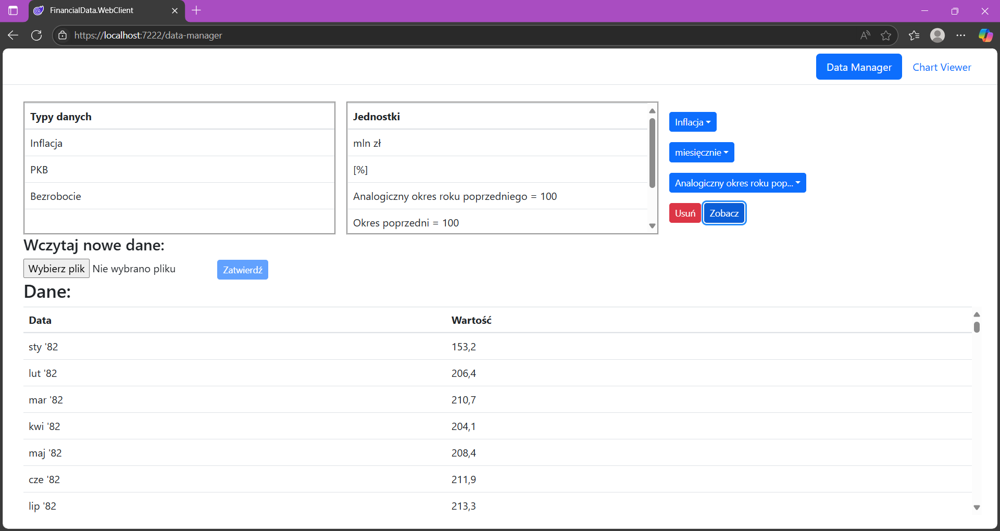

## Wnioski i pomysły na rozwój

Praca nad projektem pozwoliła mi rozwinąć umiejętności programistyczne i poznać technologie powiązane z ASP.NET. Była to moja pierwsza styczność z technologiami webowymi i kończąc projekt zauważyłem kilka rzeczy, które można było zrobić lepiej. Tworząc tabele bazodanowe nie zastosowałem kluczy obcych, co bardzo uprościłoby implementację `Selector` oraz wgrywania nowych danych.  
Na wykresach scatter danych o różnych częstotliwościach dane o większej częstotliwości używają pierwszego okresu (styczeń, QI), być może lepszym podejściem byłoby zastosowanie średniej.

Aplikacja może być rozszerzana o nowe funkcjonalności, przede wszystkim automatyczne aktualizowanie danych i prognozy. Automatyczne aktualizowanie byłoby zrealizowane za pomocą API GUSu. Umożliwia ono pobranie danych z jednego punktu w czasie na raz więc aktualizowanie polegałoby na cyklicznym pobieraniu pojedynczych rekordów. Prognozy mogą być zrealizowane z użyciem własnego API Pythonowego które na podstawie danych historycznych generowałoby je za pomocą metod takich jak ARIMA, regresja wieloraka i uczenie maszynowe. Niestety ze względu na specyfikę danych ekonomicznych które zależą głównie od wydarzeń losowych i decyzji politycznych, akuratne prognozy wyłącznie na podstawie danych historycznych są praktycznie niemożliwe.  


